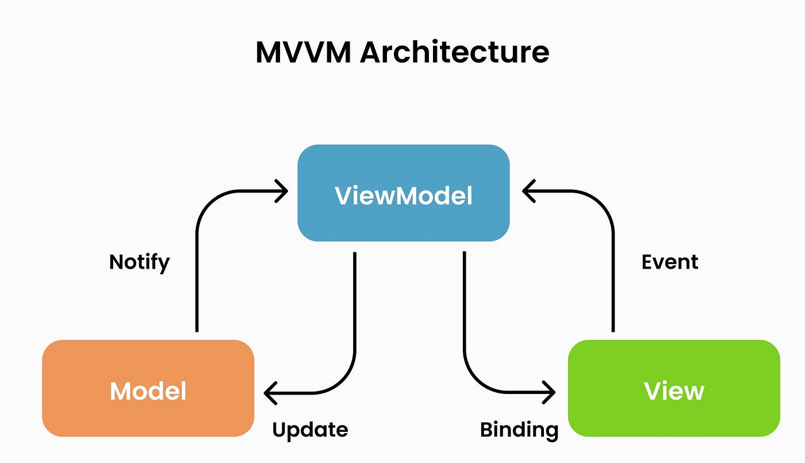

# 📝 SimpleNotesApp: A Modern Android Notes Application

SimpleNotesApp is a minimalist yet feature-rich notes application built entirely with **Jetpack Compose**, Google's modern toolkit for building native Android UI. It serves as a practical example of contemporary Android development practices, including:

-   **Declarative UI:** Jetpack Compose for a reactive and efficient UI layer.
-   **Local Persistence:** **Room** database for robust and offline-first data storage.
-   **MVVM Architecture:** Clear separation of concerns for better maintainability and testability.
-   **Material 3 Theming:** Adherence to the latest Material Design guidelines with dynamic light/dark theme support.
-   **User-Friendly Features:** Includes a splash screen, recently deleted notes, and undo capabilities for common actions.

This project is ideal for developers looking to understand a clean, Compose-first Android application structure.

---

## ✨ Core Features

### ✅ Splash Screen
-   **Welcoming Introduction:** Displays a visually appealing screen on app launch.
-   **Smooth Transition:** Uses `LaunchedEffect` and Jetpack Navigation to seamlessly transition to the main note list after a brief delay, ensuring a good user experience.

### 🗒️ Empty Notes View
-   **Guidance for New Users:** If no notes are present, a user-friendly message with appropriate padding is displayed, prompting the user to create their first note.

### ➕ Add & Edit Notes
-   **Focused Input:** A dedicated full-screen view allows users to input a title and content for their notes.
-   **Local Persistence:** Notes are saved directly to the local Room database upon confirmation, ensuring data is not lost.
-   *(Implicit: Editing would likely use a similar screen, pre-filled with existing note data.)*

### 🧱 Note Display & Management
-   **Efficient Scrolling:** Notes are presented in a vertically scrollable list using `LazyColumn`, which only composes and lays out visible items.
-   **Clear Information Hierarchy:** Each note item is displayed as a distinct card and includes:
  -   **Title:** Prominently displayed.
  -   **Content Preview:** A snippet of the note content.
  -   **Contextual Actions:** A button to **Delete** (for active notes) or **Restore** (for recently deleted notes).

### ☰ Sidebar Navigation (Navigation Drawer)
-   **Easy Access:** A standard Material Design navigation drawer, accessible via a hamburger icon in the top app bar.
-   **Key Sections:** The drawer menu provides navigation to:
  -   **Notes:** The default view, showing all active notes.
  -   **Recently Deleted:** A dedicated view for notes that have been soft-deleted.
  -   **Toggle Theme:** Allows instant switching between light and dark modes.
-   **Dynamic Content Loading:** Selecting "Recently Deleted" reloads the note list to display only soft-deleted notes, with the option to restore them.

### 🌘 Dynamic Theme Switching
-   **User Preference:** Easily toggle between **light** and **dark** application themes via the navigation drawer.
-   **State Management:** Utilizes `MaterialTheme` from Compose and a `ThemeViewModel` which manages the current theme state using a `StateFlow`. This ensures the theme change is propagated reactively throughout the app.
-   *(Implicit: Theme choice could be persisted using DataStore or SharedPreferences for future app launches.)*

### 🧪 Undo Support for Actions
-   **Mistake-Proof:** Critical actions like deleting or restoring a note are accompanied by a **Snackbar** notification.
-   **Immediate Reversal:** The Snackbar includes an **UNDO** action, allowing users to quickly revert the last operation.
-   **Implementation:** Leverages `SnackbarHostState` within the `Scaffold` composable. The undo action typically involves invoking the inverse of the original ViewModel operation (e.g., calling `restoreNote` after `softDeleteNote`).

---

## 🧱 Architecture Overview: MVVM

The application adheres to the Model-View-ViewModel (MVVM) architectural pattern, promoting a separation of concerns and enhancing testability and scalability.

<p align="center">
  
</p>

-   **Model (Data Layer)**:
  -   `Note`: A Room `@Entity` data class (`com.example.simplenotesapp.model.Note`) representing the structure of a single note. Includes fields like `id`, `title`, `content`, `timestamp`, and `isDeleted`.
  -   `NoteDao`: A Room `@Dao` interface (`com.example.simplenotesapp.data.NoteDao`) defining database operations (queries, inserts, updates, deletes).
  -   `NoteDatabase`: The Room `@Database` class (`com.example.simplenotesapp.data.NoteDatabase`) that defines the database configuration and provides access to the DAO.

-   **ViewModel (Presentation Logic Layer)**:
  -   `NoteViewModel` (`com.example.simplenotesapp.viewmodel.NoteViewModel`):
    -   Manages and exposes note-related data to the UI, typically as `StateFlow<List<Note>>`.
    -   Handles business logic for loading, adding, soft-deleting, and restoring notes by interacting with the `NoteDao`.
    -   Is lifecycle-aware, ensuring data is handled correctly across configuration changes.
  -   `ThemeViewModel` (`com.example.simplenotesapp.viewmodel.ThemeViewModel`):
    -   Manages the current theme state (light/dark) and provides functionality to toggle it.
    -   Exposes the theme state as a `StateFlow<Boolean>`.

-   **View (UI Layer)**:
  -   Built entirely with **Jetpack Compose** (various files under `com.example.simplenotesapp.screen`).
  -   **Composables:** Reusable UI components like `NoteListScreen`, `AddNoteScreen`, `SplashScreen`, `NoteItem`.
  -   **State Observation:** Observes `StateFlow`s from ViewModels using `collectAsState()` to reactively update the UI when data changes.
  -   **Layout Primitives:** Utilizes Compose layout components like `Scaffold`, `ModalNavigationDrawer`, `LazyColumn`, `Card`, `Column`, `Row`, `TopAppBar`, and `FloatingActionButton`.
  -   **Navigation:** Uses `NavHostController` and `composable` functions from Navigation Compose to define the app's navigation graph in `MainActivity`.

---

## 🗄️ Database: Room Integration Details

Room Persistence Library is used for local data storage, providing an abstraction layer over SQLite.

-   **Note Entity (`Note.kt`)**:
-   **Data Access Object (`NoteDao.kt`)**: Defines methods for database interaction.
  -   `getActiveNotes(): Flow<List<Note>>` → Fetches non-deleted notes.
  -   `getDeletedNotes(): Flow<List<Note>>` → Fetches soft-deleted notes.
  -   `suspend fun insertNote(note: Note)`
  -   `suspend fun updateNote(note: Note)` → Used for soft delete/restore by updating `isDeleted`.
  -   `suspend fun deleteNote(note: Note)` → (If you implement hard delete, otherwise `updateNote` handles soft delete)

-   **Database Class (`NoteDatabase.kt`)**: Singleton providing database instance and DAO.

---

## 🚀 Getting Started

To get a local copy up and running, follow these simple steps:

1.  **Prerequisites:**
  *   Android Studio (latest stable version recommended, e.g., Iguana or newer).
  *   Android SDK Platform corresponding to the `compileSdk` version specified in your project's `build.gradle.kts` file.
  *   An Android Emulator or a physical Android device (API level `minSdk` or higher, as defined in your project's `build.gradle.kts` file).

2.  **Clone the Repository**
3. **Open in Android Studio**
4. **Run the app on an emulator or device**
5. **Start taking and managing notes!**

```
    